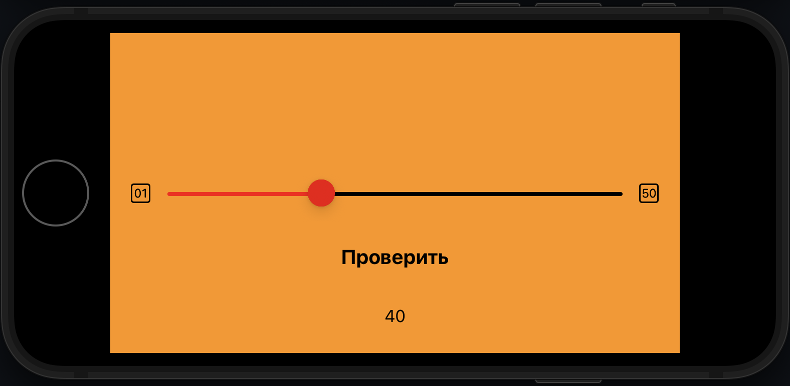
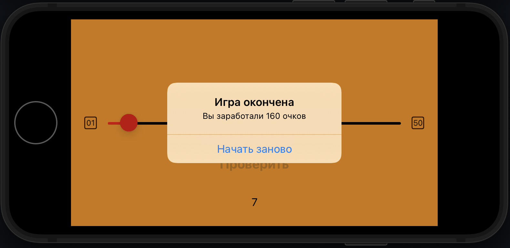

# Right-on-target

Right on target - игра, в которой пользователь должен набрать максимальное количество баллов 
с помощью установки бегунка на слайдере на более точную позицию, загаданную приложением.

# Интерфейс
1. Угадываем позицию числа с помощью бегунка:

2. После пяти раундов высвечивается количество набранных очков:

# Используемый стек технологий
- Язык программирования - Swift
- Интерфейс - UIKit
- iOS 15.5+
